# gps-map-camera-clone

A GPS-enabled camera app that allows users to take photos with geolocation tags for easy location tracking.

## Getting Started

This project is a starting point for a Flutter application that utilizes GPS functionality to enhance photography.

### Features

- Capture photos with embedded geolocation tags
- Easy location tracking and photo organization

### Screenshots
*Note: Ensure screenshots are kept small for efficient loading and presentation.*

    
    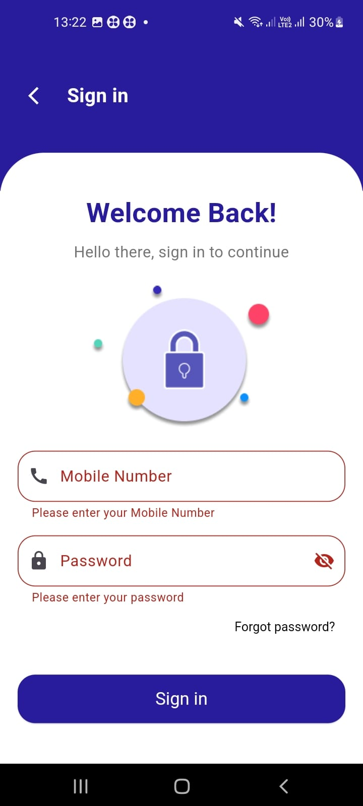
    
    
    
    
    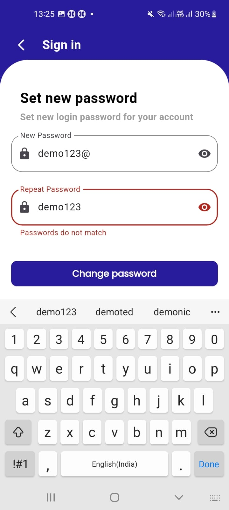
    
    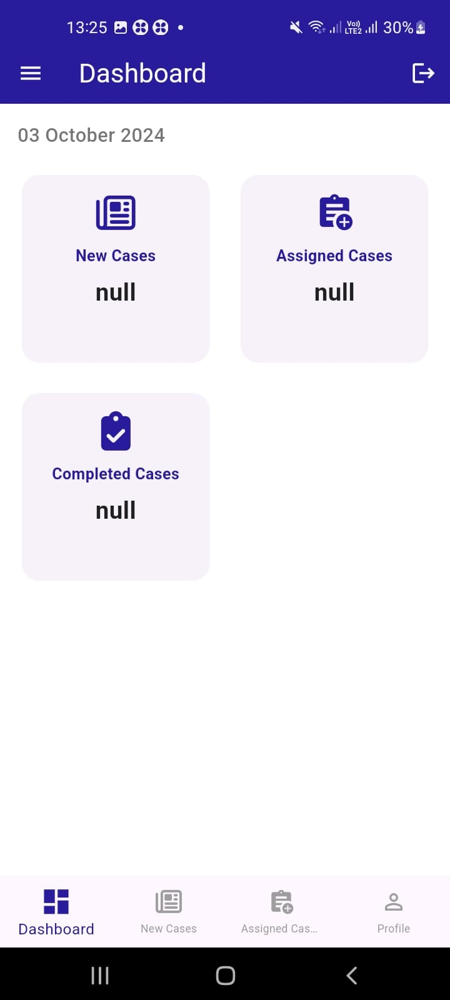
    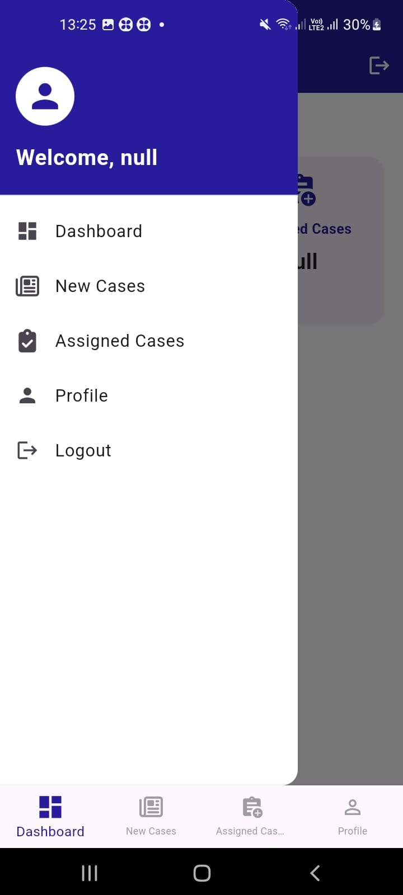
    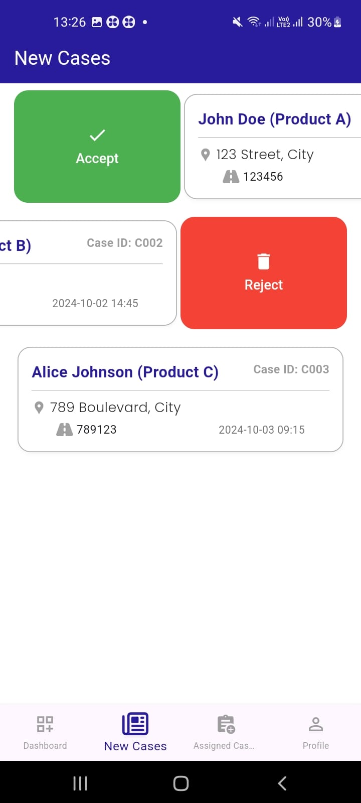
    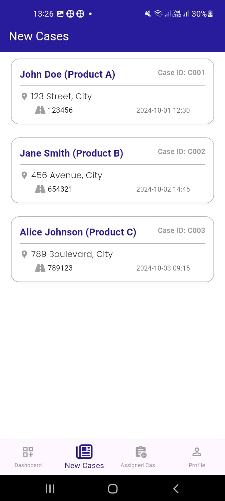
    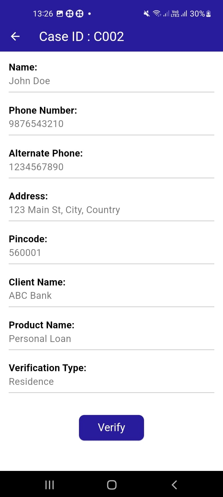
    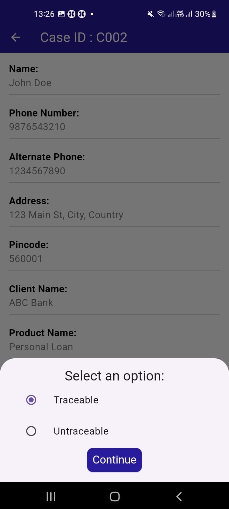
    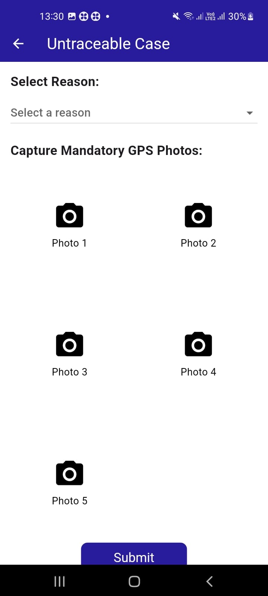
    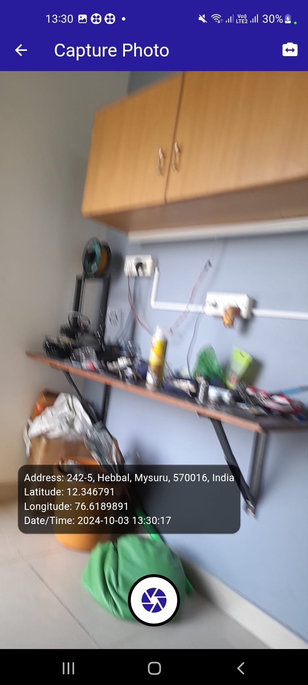
    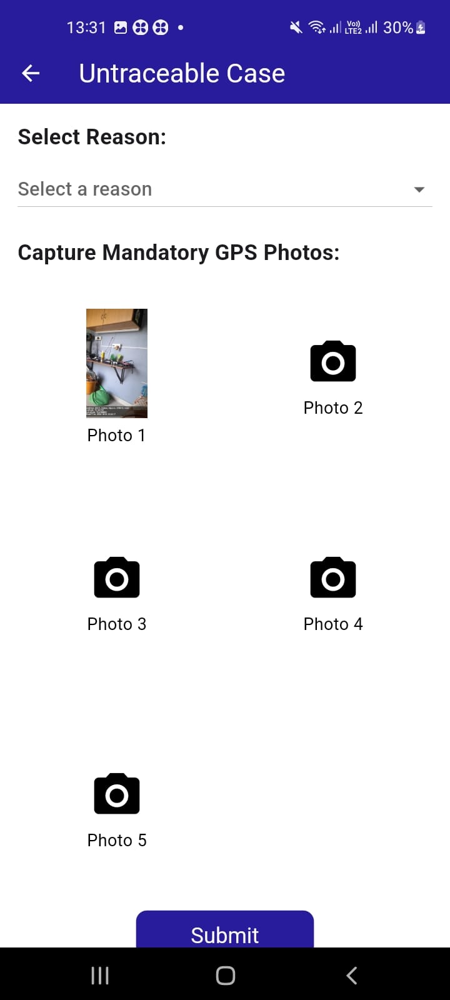
    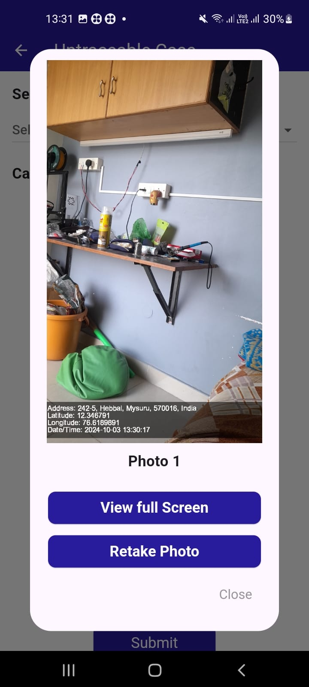

